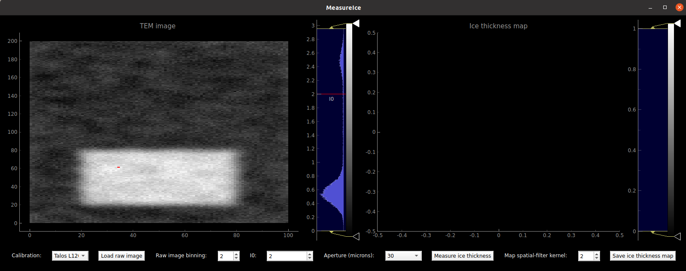
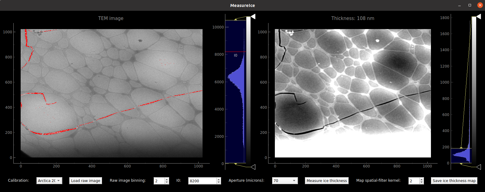

# MeasureIce


A software tool for measuring ice thickness on the fly in cryo-EM

# Installation

1. Clone or branch this repo and the py_multislice package into a directory on your computer. Using a Linux or Mac command-line or [git bash](https://gitforwindows.org/) on Windows:
```
    $ git clone https://github.com/HamishGBrown/Measureice.git
    $ git clone https://github.com/HamishGBrown/py_multislice.git
```
2. It's best to create a specific [anaconda environment](https://www.anaconda.com/products/individual) within which to run the 
utilities. Within your terminal (linux and mac) or Anaconda interpreter (Windows):
```
    $ conda create --name measureice
    $ conda activate measureice
```
3. The multislice library requires a version of the pytorch library before 1.8.0 eg. 1.7.0 (the py_multislice library is incompatible with changes to the Fast Fourier transform libraries made for version 1.8.0 and after, rectifying this is a work in progress...). See instructions [here](https://pytorch.org/get-started/previous-versions/). Since the multislice component of the simulations is not particularly intensive it is simpler just to use the cpuonly version of this library eg:

    `$ conda install pytorch==1.7.1 torchvision==0.8.2 torchaudio==0.7.2 cpuonly -c pytorch`

4. In your terminal or Anaconda interpreter navigate to measureice directory and run the `pip install` command:
```    
    $ cd py_multislice
    $ pip install .
    $ cd ../measureIce
    $ pip install .
```
# Running Measureice

1. First you'll need to generate your calibration data. You need to know your microscope's accelerating voltage and the size of the apertures (in diffraction plane units like inverse Angstrom or mrad, not micron, you can measure this with a diffraction standard like a gold grid). Run `Generate_MeasureIce_calibration.py` with the `--help` argument to get more information on how to use the utility.
```
$ python Generate_MeasureIce_calibration.py --help

Usage: 
 python Generate_MeasureIce_calibration.py -E 300 -A 9.9,15.0 -u mrad

Generates calibration files for MeasureIce utility
for measuring ice thickness in cryo-EM

-E, --Electronenergy  Electron energy (in keV)
-A, --Aperturesizes   Aperture sizes in inverse Angstrom (default) or mrad
-u, --Units           Aperture size units (invA by default or mrad), optional
-m, --Aperturemicron  Aperture sizes in microns (for labelling of output), optional
-o, --Outputfilename  Output .h5 filename (default Calibration.h5), optional
-M, --Microscopename  Name of microscope (For book-keeping), optional
-P, --Plot            Generate reference I/I0 vs thickness plot, optional
```
2. Once you have succesfully generated the calibration data, you can run the GUI utility:
```
$ python MeasureIce.py
```
It will search for .h5 calibration files in the current directory. Alternatively, you can provide a directory containing the calibration files:
```
$ python MeasureIce.py /path/to/calibration/files
```
The GUI should look like this. 



Choose a calibration file (this will match the `--Microscopename` you gave to `Generate_MeasureIce_calibration.py`, if none was supplied it will be a something more generic like 200_keV_TEM), load an image (accepts .mrc, .tif or .ser) with the `Load raw image` button, set I0 either by dragging the red line on the TEM image histogram or manually input into the I0 box and click the `Meaure ice thickness` button. You can read off ice thickness values using by hovering your mouse pointer over the region of interest in the ice thickness panel. 



Ice thickness maps can be saved in 32-bit tif format or a matplotlib imshow plot in pdf or png format.

### Want to run MeasureIce on your microscope control PC and don't really want to install python?

You can package the program as a stand-alone executable, eg. to run on a microscope support or control PC, using [pyinstaller](https://www.pyinstaller.org/). If you want to run the program on, for example a Windows PC, you'll need to do this step on _that_ operating system.
```
$ pip install pyinstaller
$ pyinstaller -i icons/icon.ico --onefile Measureice.py
```
An executable, `Measureice.exe`, should appear in a new folder named `dist`. You can transfer this to your microscope PC, remember to also transfer your .h5 calibration files as well.

# Acknowledgements

This work was done in partnership with [Prof. Eric Hanssen](https://findanexpert.unimelb.edu.au/profile/333629-eric-hanssen) at the [Ian Holmes Imaging Center](https://microscopy.unimelb.edu.au/em). Code for [reading ser files](https://github.com/ercius/openNCEM) is written by [Peter Ercius](https://github.com/ercius) of the National Centre for Electron Microscopy.


